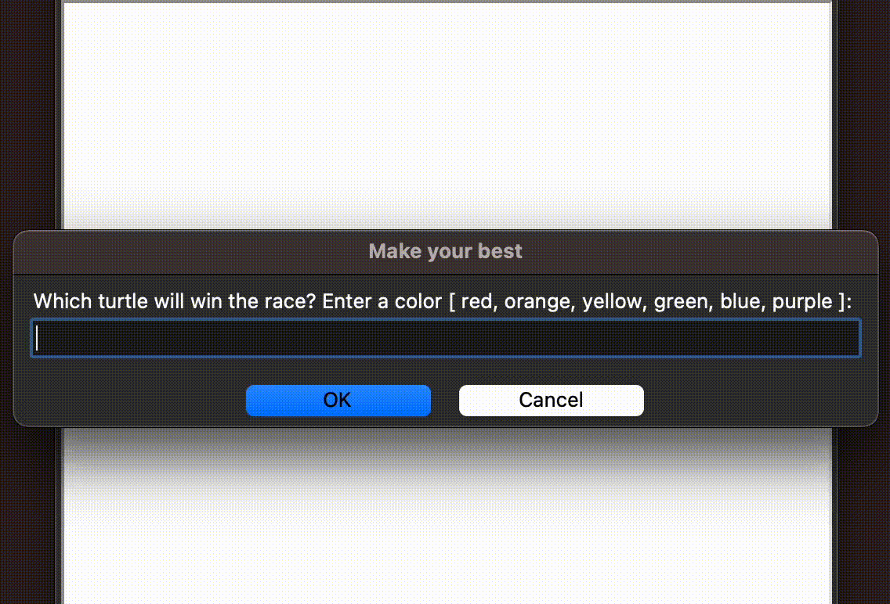

# py-turtle-graphics

A collection of Python Turtle scripts for creating art, games, and animations

### How to run

1. Install the packages:
   ```bash
   pip install -r requirements.txt
   ```
2. Navigate to the directory of the desired application:
   ```bash
   cd [application_name]
   ```
3. Execute the main Python script:
   ```bash
   python main.py
   ```

---

### Fruit-Snake


---

### Turtle-Race



---

### Hirst-Dots-Art


---

### Sketch-Book


