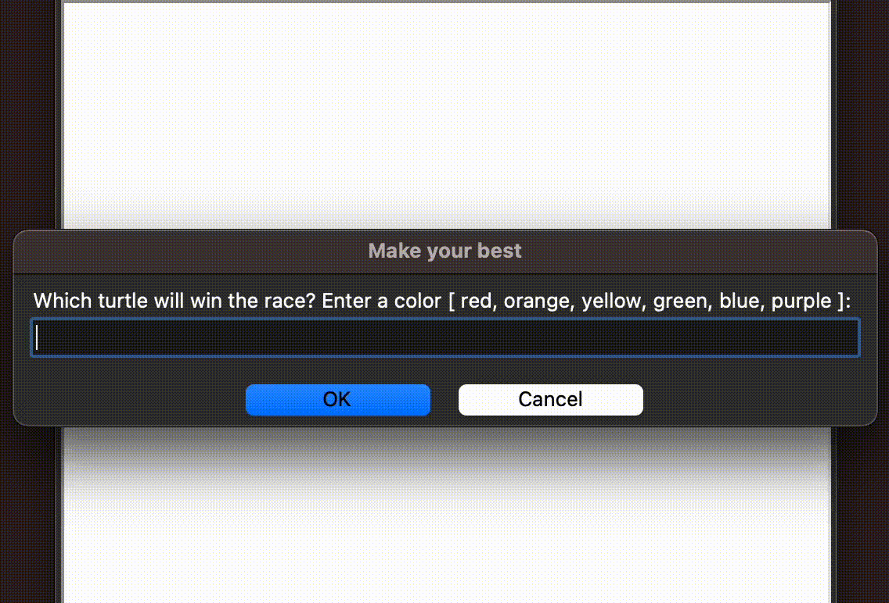

# py-turtle-graphics

A collection of Python Turtle scripts for creating art, games, and animations

### How to run

1. Python used:

   ```bash
   python --version
   Python 3.12.4
   ```

2. Install the packages:

   ```bash
   pip install -r requirements.txt
   ```

3. Navigate to the directory of the desired application:
   ```bash
   cd [application_name]
   ```
4. Execute the main Python script:
   ```bash
   python main.py
   ```

---

<br><br>

<h3 align="center">Pong</h3>
<p align="center">
  
</p>

<br><br>

<h3 align="center">Fruit-Snake</h3>
<p align="center">
  
</p>

<br><br>

<h3 align="center">Turtle-Race</h3>
<p align="center">
  
</p>

<br><br>

<h3 align="center">Hirst-Dots-Art</h3>
<p align="center">
  
</p>

<br><br>

<h3 align="center">Sketch-Book</h3>
<p align="center">
  
</p>
